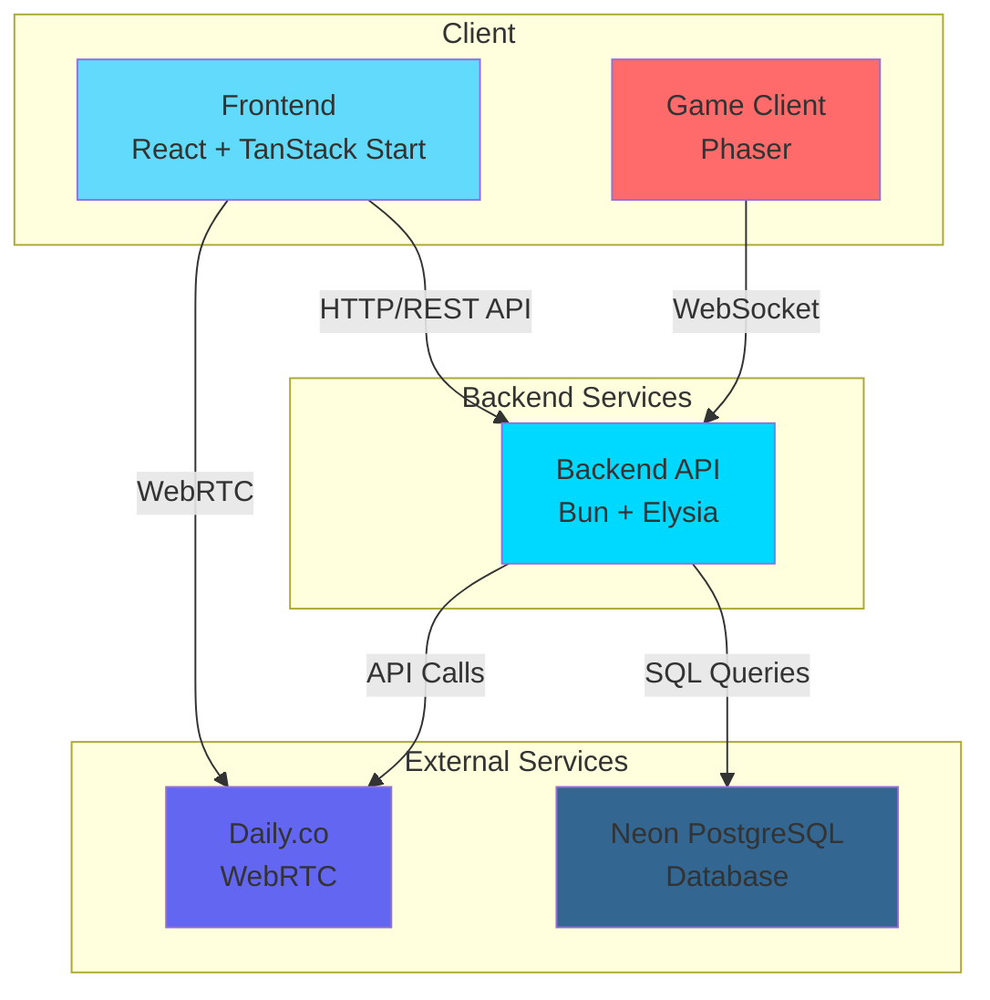

# Initial Ideas V1

## Overview

This document outlines the initial ideas for the Empat Challenge.

Based on the [Challenge Info](./challenge-info.mdx) document, we'll be building a mini virtual speech therapy platform with the following core features:

- Video Call Sessions: Simple therapist/child video call session
- Interactive Game: One basic interactive Phaser-based game (communication, language, or speech theme)
- Session Data Recording: Basic session data recording by SLP
- Student Profile: Simple student profile with progress visualization
- Caseload View: List of students under SLP, and their overall metrics
- AI Session Summary: End of session AI-generated session summary (using any LLM API)
- Deployment: Deploy to cloud platform (Heroku, Vercel, Railway, etc.)

## Initial Ideas

### System Architecture

We're going to use the following architecture:

- Frontend: React with TanStack Start
- Backend: Bun with Elysia
- Database: Neon PostgreSQL
- WebRTC: Daily
- Game: Phaser with Sockets



## Database Schemas

**Note**: Authentication is handled by better-auth's built-in schemas (`user`, `account`, `session`). Both SLPs and students require accounts to access video calls and interactive games.

### Student Table

Table to store student (child) information. Since students are children, we store minimal information. The parent/guardian account (better-auth `user`) is the anchor point - each parent can have multiple students. Students access the platform through their parent's account.

| Field        | Type      | Required | Description                                                             |
| ------------ | --------- | -------- | ----------------------------------------------------------------------- |
| id           | string    | Yes      | The unique identifier for the student.                                  |
| parentUserId | string    | Yes      | Foreign key to better-auth `user` table (parent/guardian account).      |
| name         | string    | Yes      | The name of the student.                                                |
| age          | number    | No       | Age of the student.                                                     |
| inactive     | timestamp | No       | Timestamp when the student became inactive. If null, student is active. |
| createdAt    | timestamp | Yes      | When the student profile was created.                                   |
| updatedAt    | timestamp | Yes      | When the student profile was last updated.                              |

Student JSON Example:

```json
{
  "id": "550e8400-e29b-41d4-a716-446655440000",
  "parentUserId": "bb0e8400-e29b-41d4-a716-446655440011",
  "name": "Emma Johnson",
  "age": 8,
  "inactive": null,
  "createdAt": "2024-01-15T10:30:00Z",
  "updatedAt": "2024-01-20T14:45:00Z"
}
```

Parent/Guardian with Students JSON Example:

```json
{
  "id": "bb0e8400-e29b-41d4-a716-446655440011",
  "email": "parent@example.com",
  "phone": "+1-555-0123",
  "address": "123 Main St, City, State 12345",
  "students": [
    {
      "id": "550e8400-e29b-41d4-a716-446655440000",
      "name": "Emma Johnson",
      "age": 8,
      "inactive": null
    }
  ]
}
```

### SLP Table

for the SLP table, we want to store the progress of the student on the system which is SLP.

For example, we want to store the following data:

- Total number of sessions
- Total number of correct trials
- Total number of incorrect trials
- Total number of trials
- Notes:
  - Subjective notes from the SLP
  - Behavioral notes from the SLP
  - Progress notes from the SLP
  - Other notes from the SLP

Table to store Speech Language Pathologist profile information. References better-auth `user` table via `userId` for authentication.

| Field     | Type      | Required | Description                                |
| --------- | --------- | -------- | ------------------------------------------ |
| id        | string    | Yes      | The unique identifier for the SLP profile. |
| userId    | string    | Yes      | Foreign key to better-auth `user` table.   |
| name      | string    | Yes      | The name of the SLP.                       |
| phone     | string    | No       | The phone number of the SLP.               |
| createdAt | timestamp | Yes      | When the SLP profile was created.          |
| updatedAt | timestamp | Yes      | When the SLP profile was last updated.     |

```json
{
  "id": "660e8400-e29b-41d4-a716-446655440001",
  "userId": "aa0e8400-e29b-41d4-a716-446655440010",
  "name": "Dr. Sarah Martinez",
  "phone": "+1-555-0456",
  "createdAt": "2024-01-10T09:00:00Z",
  "updatedAt": "2024-01-25T16:20:00Z"
}
```

### Caseload Table

Table to manage the relationship between SLPs and their students, enabling the caseload view feature.

| Field     | Type      | Required | Description                                   |
| --------- | --------- | -------- | --------------------------------------------- |
| id        | string    | Yes      | The unique identifier for the caseload entry. |
| slpId     | string    | Yes      | Foreign key to the `slp` table.               |
| studentId | string    | Yes      | Foreign key to the `student` table.           |
| createdAt | timestamp | Yes      | When the student was added to the caseload.   |
| updatedAt | timestamp | Yes      | When the caseload entry was last updated.     |

```json
{
  "id": "770e8400-e29b-41d4-a716-446655440002",
  "slpId": "660e8400-e29b-41d4-a716-446655440001",
  "studentId": "550e8400-e29b-41d4-a716-446655440000",
  "createdAt": "2024-01-16T11:00:00Z",
  "updatedAt": "2024-01-16T11:00:00Z"
}
```

### Therapy Session Table

Table to track video call sessions between SLP and students, integrated with Daily.co for WebRTC.

| Field       | Type      | Required | Description                                                      |
| ----------- | --------- | -------- | ---------------------------------------------------------------- |
| id          | string    | Yes      | The unique identifier for the session.                           |
| slpId       | string    | Yes      | Foreign key to the SLP table.                                    |
| studentId   | string    | Yes      | Foreign key to the Student table.                                |
| dailyRoomId | string    | Yes      | The Daily.co room ID for the video call.                         |
| status      | string    | Yes      | Session status: 'scheduled', 'active', 'completed', 'cancelled'. |
| startTime   | timestamp | No       | When the session started.                                        |
| endTime     | timestamp | No       | When the session ended.                                          |
| duration    | number    | No       | Session duration in minutes.                                     |
| createdAt   | timestamp | Yes      | When the session was created.                                    |
| updatedAt   | timestamp | Yes      | When the session was last updated.                               |

```json
{
  "id": "880e8400-e29b-41d4-a716-446655440003",
  "slpId": "660e8400-e29b-41d4-a716-446655440001",
  "studentId": "550e8400-e29b-41d4-a716-446655440000",
  "dailyRoomId": "abc123xyz",
  "status": "completed",
  "startTime": "2024-01-20T14:00:00Z",
  "endTime": "2024-01-20T14:30:00Z",
  "duration": 30,
  "createdAt": "2024-01-19T10:00:00Z",
  "updatedAt": "2024-01-20T14:30:00Z"
}
```

### Session Data Recording Table

Table to store session data including correct/incorrect trials, percentage correct, and behavioral notes recorded by the SLP.

| Field             | Type      | Required | Description                                |
| ----------------- | --------- | -------- | ------------------------------------------ |
| id                | string    | Yes      | The unique identifier for the recording.   |
| sessionId         | string    | Yes      | Foreign key to the Session table.          |
| totalTrials       | number    | Yes      | Total number of trials in the session.     |
| correctTrials     | number    | Yes      | Number of correct trials.                  |
| incorrectTrials   | number    | Yes      | Number of incorrect trials.                |
| percentageCorrect | number    | Yes      | Percentage of correct trials (calculated). |
| notes             | text      | No       | Subjective/behavioral notes from the SLP.  |
| createdAt         | timestamp | Yes      | When the recording was created.            |
| updatedAt         | timestamp | Yes      | When the recording was last updated.       |

```json
{
  "id": "990e8400-e29b-41d4-a716-446655440004",
  "sessionId": "880e8400-e29b-41d4-a716-446655440003",
  "totalTrials": 20,
  "correctTrials": 16,
  "incorrectTrials": 4,
  "percentageCorrect": 80.0,
  "notes": "Student showed good progress with pronunciation. Needs more practice with 'th' sounds.",
  "createdAt": "2024-01-20T14:30:00Z",
  "updatedAt": "2024-01-20T14:35:00Z"
}
```

### Game Session Table

Table to track Phaser-based interactive game sessions with WebSocket synchronization for turn-based gameplay between SLP and student.

| Field       | Type      | Required | Description                                          |
| ----------- | --------- | -------- | ---------------------------------------------------- |
| id          | string    | Yes      | The unique identifier for the game session.          |
| sessionId   | string    | Yes      | Foreign key to the Session table.                    |
| gameType    | string    | Yes      | Type of game: 'communication', 'language', 'speech'. |
| currentTurn | string    | Yes      | Current player: 'slp' or 'student'.                  |
| gameState   | json      | Yes      | Current game state (Phaser game state).              |
| isActive    | boolean   | Yes      | Whether the game is currently active.                |
| createdAt   | timestamp | Yes      | When the game session was created.                   |
| updatedAt   | timestamp | Yes      | When the game session was last updated.              |

```json
{
  "id": "aa0e8400-e29b-41d4-a716-446655440005",
  "sessionId": "880e8400-e29b-41d4-a716-446655440003",
  "gameType": "speech",
  "currentTurn": "student",
  "gameState": {
    "score": 150,
    "level": 2,
    "items": ["word1", "word2", "word3"],
    "progress": 0.6
  },
  "isActive": true,
  "createdAt": "2024-01-20T14:15:00Z",
  "updatedAt": "2024-01-20T14:25:00Z"
}
```

## Web RTC

We're going to use the [Daily](https://daily.co/) API to create a video call session.

Let's see how easy it is to use Daily.co with Bun and Elysia.
