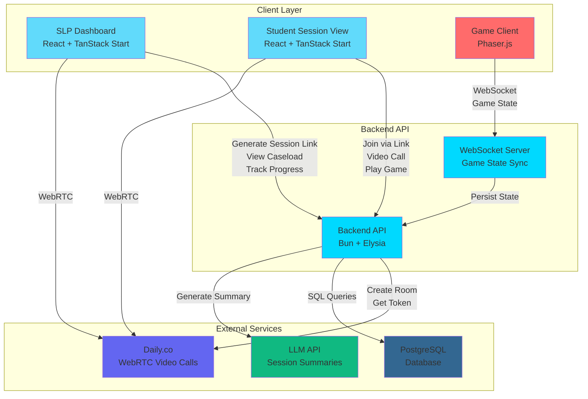

# Initial Ideas V2

## Information provided

Based on the [initial ideas v1](./initial-ideas-v1.mdx) document, I required some extra information and this is what I got:

The assumptions sound very reasonable: We do have something similar actually! (Where schools manage the students)

For this project, so you can cover more ground (we agree with you!) please keep the model simple (SLP generates links for sessions, minimal roles, no parent dashboard - but see if you can get for the SLP some version of that simple student profile with progress visualization).

## System Architecture

### Simplified Architecture Diagram

The system has been simplified to focus on core functionality. The key changes from V1 are:

- **SLP generates links for sessions** (no complex scheduling system)
- **Minimal roles** (SLP and Student only, no parent/guardian complexity)
- **No parent dashboard** (removed from scope)
- **Student profile with progress visualization** (for SLP view only)



### Architecture Changes from V1

- **Removed parent/guardian authentication complexity**: Students are directly linked to SLPs via caseload
- **Simplified session creation**: Link-based instead of scheduled appointments
- **Direct SLP-Student relationship**: No parent intermediary required
- **Focus on SLP dashboard**: Primary interface for managing students and sessions
- **Student view is session-specific**: Accessed via generated link, no separate dashboard

## Core Features

### Feature 1: Session Link Generation

**Definition**: SLP can generate unique, shareable links for therapy sessions. Each link is tied to a specific student and session instance.

**Scope**:
- Generate unique session links with embedded session ID and student ID
- Links can be time-limited or single-use (configurable)
- No scheduling system needed - links are generated on-demand
- Links stored in database with metadata (created date, expiration, usage status)

**User Flow**:
1. SLP selects a student from their caseload
2. SLP clicks "Generate Session Link"
3. System creates a new session record and generates a unique link
4. SLP shares the link with student/parent via email, SMS, or copy-paste
5. Student accesses the link to join the session

### Feature 2: Video Call Sessions

**Definition**: Simple video call interface using Daily.co WebRTC. Both SLP and student join via the session link.

**Scope**:
- Daily.co room creation per session (automatic when link is generated)
- WebRTC video/audio connection for both participants
- Basic controls (mute, video toggle, screen share)
- Session status tracking (scheduled, active, completed, cancelled)
- Room cleanup after session completion

**User Flow**:
1. Student clicks session link
2. System validates link and creates Daily.co room if needed
3. Both participants join the video call
4. Session status updated to "active" when call starts
5. Session status updated to "completed" when call ends

### Feature 3: Interactive Phaser Game

**Definition**: Turn-based interactive game built with Phaser.js, synchronized via WebSockets. Both participants can play during the session.

**Scope**:
- One basic game (communication/language/speech theme)
- WebSocket synchronization for real-time game state
- Turn-based gameplay (SLP and student alternate turns)
- Game state persisted during session
- Game results can be used for trial tracking

**User Flow**:
1. During video call, SLP initiates a game session
2. Game loads in embedded iframe or overlay
3. Participants take turns playing
4. Game results tracked as trials (correct/incorrect)
5. Game state saved to database for session recording

### Feature 4: Session Data Recording

**Definition**: SLP records trial data (correct/incorrect) and behavioral notes during the session.

**Scope**:
- Real-time trial tracking (correct/incorrect buttons)
- Automatic percentage correct calculation
- Behavioral/subjective notes input (text area)
- Data saved to database in real-time or at session end
- Data linked to specific session and student

**User Flow**:
1. During session, SLP records each trial (correct/incorrect)
2. System calculates running percentage
3. SLP adds behavioral notes as needed
4. At session end, all data is saved
5. Data becomes part of student's progress history

### Feature 5: Student Profile with Progress Visualization

**Definition**: SLP view showing individual student progress across sessions with visual charts/graphs.

**Scope**:
- Progress metrics (total sessions, total trials, accuracy trends over time)
- Visual charts (line graphs for accuracy trends, progress bars for completion)
- Recent session summaries (last 3 sessions with key metrics)
- Overall performance indicators (average accuracy, improvement trends)
- Filter by date range or session type

**User Flow**:
1. SLP navigates to caseload view
2. SLP clicks on a student
3. Student profile page loads with progress visualization
4. SLP can view historical data, recent sessions, and trends
5. SLP can generate new session link from profile page

### Feature 6: Caseload View

**Definition**: SLP dashboard showing all students with their overall metrics in a list/table format.

**Scope**:
- List of all students in SLP's caseload
- Quick metrics per student (sessions count, average accuracy, last session date)
- Click-through to individual student profiles
- Filtering/sorting capabilities (by name, last session, performance)
- Quick actions (generate session link, view profile)

**User Flow**:
1. SLP logs in and lands on caseload view
2. Sees list of all their students with key metrics
3. Can filter or sort the list
4. Clicks on student to view detailed profile
5. Can generate session link directly from caseload view

### Feature 7: AI Session Summary (Scaffolded)

**Definition**: End-of-session AI-generated summary using LLM API. Display recent 3 summaries on student profile.

**Scope**:
- Scaffold API endpoint for LLM integration (OpenAI, Anthropic, etc.)
- Summary generation trigger (post-session completion)
- Storage of summaries in database
- Display on student profile (recent 3 summaries)
- Summary includes: key achievements, areas for improvement, recommendations

**User Flow**:
1. Session ends and data is recorded
2. System triggers AI summary generation (scaffolded - not fully implemented)
3. Summary stored in database linked to session
4. Summary appears on student profile in "Recent Summaries" section
5. SLP can view summaries to track student progress over time

## Features List

1. **Session Link Generation** - Core feature for creating shareable session links
2. **Video Call Sessions** - Core feature for video therapy sessions
3. **Interactive Phaser Game** - Core feature for engaging therapy activities
4. **Session Data Recording** - Core feature for tracking therapy progress
5. **Student Profile with Progress Visualization** - Important feature for SLP insights
6. **Caseload View** - Core feature for managing multiple students
7. **AI Session Summary** - Scaffolded feature for future enhancement

## Features Summary Table

| Feature ID | Feature Name | Description | Priority | Status | Dependencies | User Role |
|------------|--------------|-------------|----------|--------|--------------|-----------|
| F1 | Session Link Generation | Generate unique, shareable links for therapy sessions | Core | To implement | Database, Authentication | SLP |
| F2 | Video Call Sessions | WebRTC video call interface using Daily.co | Core | To implement | Daily.co API, Session Link (F1) | Both |
| F3 | Interactive Phaser Game | Turn-based game synchronized via WebSockets | Core | To implement | WebSocket Server, Session Link (F1) | Both |
| F4 | Session Data Recording | Record trial data and behavioral notes | Core | To implement | Session Link (F1), Database | SLP |
| F5 | Student Profile with Progress | Visual progress tracking for individual students | Important | To implement | Session Data Recording (F4), Database | SLP |
| F6 | Caseload View | Dashboard showing all students with metrics | Core | To implement | Student Profile (F5), Database | SLP |
| F7 | AI Session Summary | AI-generated session summaries | Nice-to-have | Scaffolded | Session Data Recording (F4), LLM API | SLP |

## Detailed Summary for AI Think-Process

### Context: What Changed from V1 and Why

The initial architecture (V1) included a parent/guardian model where parents managed multiple students. Based on feedback, this was simplified to focus on the core therapy delivery workflow:

**Key Simplifications**:
- **Removed parent/guardian complexity**: Students are now directly linked to SLPs via the caseload relationship. This eliminates the need for parent authentication, parent dashboards, and the parent-student relationship management.
- **Link-based sessions**: Instead of a scheduling system, SLPs generate on-demand session links. This is simpler to implement and covers the core use case effectively.
- **Minimal roles**: Only two user types - SLP and Student. Students access sessions via links without needing a full dashboard.

**Why These Changes**:
- Faster development and deployment within the 7-day timeline
- Focus on core therapy delivery features
- Reduced complexity in authentication and authorization
- Easier to demonstrate and test core functionality

### Simplified Data Model

**Key Entities**:

1. **SLP (Speech Language Pathologist)**
   - Linked to better-auth `user` table via `userId`
   - Has profile information (name, phone)
   - Manages a caseload of students

2. **Student**
   - Directly linked to SLP via `slpId` (removed `parentUserId`)
   - Minimal information (name, age, inactive status)
   - No separate authentication - accessed via session links

3. **Caseload**
   - Many-to-many relationship between SLP and Student
   - Enables SLP to manage multiple students

4. **Therapy Session**
   - Created when SLP generates a link
   - Contains Daily.co room ID
   - Tracks session status and timing

5. **Session Data Recording**
   - Linked to therapy session
   - Stores trial data (correct/incorrect)
   - Contains behavioral notes

6. **Game Session**
   - Linked to therapy session
   - Stores Phaser game state
   - Synchronized via WebSockets

7. **AI Session Summary** (scaffolded)
   - Linked to therapy session
   - Generated post-session
   - Displayed on student profile

**Relationships**:
```
SLP (1) ←→ (Many) Caseload (Many) ←→ (1) Student
SLP (1) ←→ (Many) Therapy Session
Student (1) ←→ (Many) Therapy Session
Therapy Session (1) ←→ (1) Session Data Recording
Therapy Session (1) ←→ (1) Game Session
Therapy Session (1) ←→ (1) AI Session Summary
```

### User Flows

#### Flow 1: SLP Generates Session Link and Conducts Session

1. SLP logs into dashboard
2. SLP views caseload and selects a student
3. SLP clicks "Generate Session Link"
4. System creates therapy session record and generates unique link
5. SLP shares link with student/parent
6. Student clicks link and joins video call
7. SLP and student conduct therapy session
8. SLP records trial data during session
9. SLP may initiate Phaser game during session
10. Session ends, data is saved
11. AI summary is generated (scaffolded)
12. Progress is updated on student profile

#### Flow 2: SLP Views Student Progress

1. SLP logs into dashboard
2. SLP views caseload list
3. SLP clicks on a student
4. Student profile loads with progress visualization
5. SLP views charts showing accuracy trends
6. SLP views recent session summaries
7. SLP can generate new session link from profile

#### Flow 3: Student Joins Session

1. Student receives session link (via email, SMS, etc.)
2. Student clicks link
3. System validates link and loads session page
4. Student joins Daily.co video call
5. Student participates in therapy activities
6. Student plays Phaser game when initiated by SLP
7. Session ends, student is redirected to completion page

### Technical Decisions

**Why Link-Based Sessions**:
- Simpler than building a scheduling system
- Covers the core use case (SLP needs to conduct sessions with students)
- Links can be shared via any channel (email, SMS, messaging apps)
- No need for calendar integration or timezone handling

**Why Direct SLP-Student Relationship**:
- Removes parent/guardian authentication complexity
- Simplifies authorization (SLP owns caseload, can access their students)
- Faster to implement and test
- Still allows for future expansion if needed

**Why Scaffold AI Summaries**:
- LLM integration is complex and time-consuming
- Demonstrates understanding of the requirement
- Provides clear extension point for future implementation
- Focuses development time on core features

**Why PostgreSQL (Not NoSQL)**:
- Already using Drizzle ORM which works well with PostgreSQL
- Relational data fits the model (SLPs, Students, Sessions, etc.)
- Better for complex queries (progress tracking, aggregations)
- Neon PostgreSQL provides good free tier

### Implementation Priorities

**Phase 1: Core Infrastructure** (Days 1-2)
- Database schema setup (simplified from V1)
- Authentication (better-auth for SLP only)
- Basic API structure (Elysia routes)
- SLP dashboard shell

**Phase 2: Session Management** (Days 2-3)
- Session link generation
- Daily.co integration
- Video call interface
- Session status tracking

**Phase 3: Therapy Features** (Days 3-5)
- Phaser game implementation
- WebSocket synchronization
- Session data recording
- Trial tracking UI

**Phase 4: Progress Tracking** (Days 5-6)
- Student profile page
- Progress visualization (charts)
- Caseload view
- Data aggregation queries

**Phase 5: Polish & Deployment** (Days 6-7)
- AI summary scaffolding
- UI polish
- Testing
- Deployment to Railway

### Open Questions

1. **Session Link Expiration**: Should links expire after a certain time, or after first use? Or remain valid indefinitely?
2. **Student Authentication**: Do students need any authentication, or is link validation sufficient?
3. **Game Types**: Should we support multiple game types, or focus on one well-implemented game?
4. **Data Retention**: How long should session data be retained? Any privacy/regulatory requirements?
5. **Multi-SLP Support**: Can a student be in multiple SLP caseloads, or one-to-one only?

### Database Schema Changes from V1

**Student Table Changes**:
- **Removed**: `parentUserId` (foreign key to parent/guardian)
- **Added**: Direct relationship via `Caseload` table (many-to-many with SLP)
- **Simplified**: No parent account needed

**New/Modified Tables**:
- **Session Link Table** (new): Stores generated links with metadata
  - `id`, `sessionId`, `linkToken`, `expiresAt`, `usedAt`, `isActive`
- **Simplified Student-SLP relationship**: Via `Caseload` junction table only

**Removed Concepts**:
- Parent/Guardian table (not needed)
- Parent dashboard (not in scope)
- Student authentication complexity (link-based access only)

**Retained from V1**:
- SLP table structure
- Therapy Session table
- Session Data Recording table
- Game Session table
- AI Session Summary table (scaffolded)

### Next Steps for Implementation

1. **Database Schema Design**: Create Drizzle schemas based on simplified model
2. **API Endpoints**: Design REST API for session link generation, data recording, progress queries
3. **Frontend Components**: Build SLP dashboard, student session view, progress charts
4. **Daily.co Integration**: Set up Daily.co API client and room management
5. **Phaser Game**: Choose game type and implement basic turn-based gameplay
6. **WebSocket Setup**: Implement game state synchronization
7. **Testing Strategy**: Unit tests for core logic, integration tests for API
8. **Deployment**: Railway setup for backend, Vercel/Cloudflare for frontend

