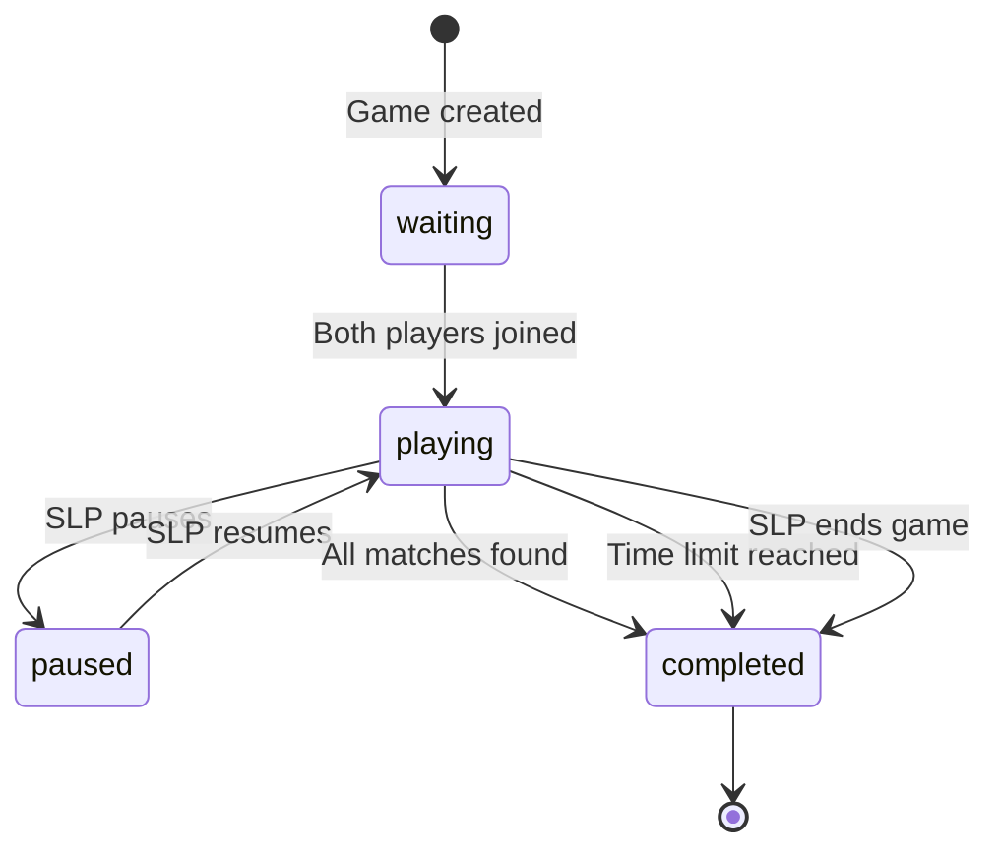
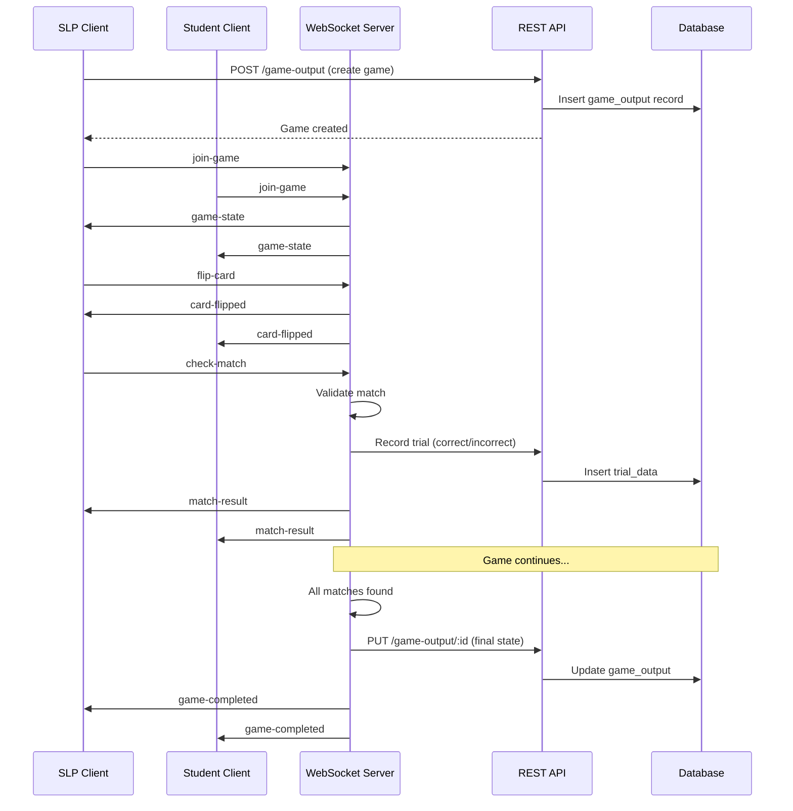

# Initial Ideas V3 - Word-Picture Match Game Design

## Information provided

Based on the [initial ideas v2](./initial-ideas-v2.mdx) document, we've selected the **Word-Picture Match** game as the core interactive therapy activity. This document provides comprehensive design details, business logic, and implementation specifications for the game.

## Game Overview

### Word-Picture Match Game Concept

**Word-Picture Match** is a turn-based memory and vocabulary game where players match image.pngword cards with their corresponding picture cards. The game is designed specifically for speech therapy sessions, helping students practice word recognition, vocabulary building, and visual association.

### Why This Game Fits the Requirements

- **Simple to implement**: Card-based gameplay is straightforward to build with Phaser.js
- **Clear correct/incorrect outcomes**: Each match attempt provides a clear trial result
- **Speech therapy relevant**: Focuses on vocabulary, word recognition, and language skills
- **Turn-based sync is straightforward**: Alternating turns simplify WebSocket synchronization
- **Visual and engaging**: Card flipping animations and match effects keep students engaged
- **Scalable difficulty**: Can adjust vocabulary complexity and number of pairs

### Core Gameplay Mechanics

1. **Card Grid**: 6-8 cards displayed in a grid (3-4 word cards, 3-4 picture cards)
2. **Turn-Based Play**: SLP and Student alternate turns
3. **Card Flipping**: Players flip cards to reveal content
4. **Matching**: Players attempt to match words with pictures
5. **Trial Tracking**: Each match attempt is recorded as correct/incorrect
6. **Win Condition**: Complete all matches or first to reach X matches

## Game Rules & Business Logic

### Game Flow

#### Initialization
1. SLP initiates game from session view
2. System selects a card set (based on difficulty or random)
3. Cards are shuffled and arranged in grid
4. Game state is initialized with all cards face-down
5. First player (SLP or Student) is determined randomly or by SLP choice

#### Turn Structure
1. Current player's turn begins
2. Player can flip up to 2 cards
3. If 2 cards are flipped:
   - System checks if they match
   - Match result is broadcast to both players
   - If match: Cards remain face-up, player gets point, turn continues
   - If no match: Cards flip back, turn ends
4. Turn switches to other player
5. Process repeats until all matches are found

#### Match Validation Logic
- **Match**: Word card's `matchId` equals Picture card's `id` (or vice versa)
- **Correct Match**: Player earns 1 point, cards stay flipped, player continues turn
- **Incorrect Match**: No point, cards flip back, turn ends immediately
- **Already Matched Cards**: Cannot be flipped again

#### Turn Switching Rules
- Turn switches when:
  - Player makes an incorrect match
  - Player explicitly ends turn (optional feature)
  - Player has no valid moves (all remaining cards are already matched)
- Turn does NOT switch when:
  - Player makes a correct match (continues turn)
  - Player flips first card (waiting for second card)

#### Game Completion Conditions
- **All matches found**: Game ends when all card pairs are matched
- **Time limit reached** (optional): Game ends after X minutes
- **Manual end**: SLP can end game early
- Final scores are calculated and saved

#### Score Calculation
- **Matches**: Number of successful matches per player
- **Attempts**: Total number of match attempts per player
- **Accuracy**: `(matches / attempts) * 100`
- **Winner**: Player with most matches (or highest accuracy if tie)

### Business Rules

1. **Only current player can flip cards**: Other player sees flipped cards but cannot interact
2. **Two cards flipped at a time maximum**: System prevents flipping more than 2 cards
3. **Match validation is server-side**: Client sends match attempt, server validates
4. **Turn switching is automatic**: After incorrect match or explicit end turn
5. **Game state is authoritative**: Server maintains true game state, clients sync
6. **Reconnection handling**: Players can reconnect and receive current game state
7. **Trial tracking**: Every match attempt is recorded as a trial (correct/incorrect)

## Card Data Structure (Hardcoded JSON)

### Location

Card data will be stored as JSON files for simplicity. Recommended location:
- `packages/domain/src/data/game-cards.json` (shared between frontend and backend)
- Or `apps/web/src/data/game-cards.json` (frontend-only if backend doesn't need it)

### Data Structure

```typescript
interface GameCardSet {
  id: string;
  name: string;
  description: string;
  difficulty: 'easy' | 'medium' | 'hard';
  category: string; // e.g., 'animals', 'food', 'objects'
  cardCount: number; // number of pairs
  cards: Card[];
}

interface Card {
  id: string;
  type: 'word' | 'picture';
  content: string; // word text for word cards
  matchId: string; // ID of the matching card
  imageUrl?: string; // URL or path to image for picture cards
  audioUrl?: string; // Optional: pronunciation audio
}
```

### Initial Card Sets

#### Easy Set (3-4 pairs)
Simple, common words suitable for beginners:
- Cat / 🐱
- Dog / 🐶
- Ball / ⚽
- Car / 🚗

#### Medium Set (4-6 pairs)
More complex vocabulary:
- Elephant / 🐘
- Butterfly / 🦋
- Mountain / ⛰️
- Rainbow / 🌈
- Telescope / 🔭
- Library / 📚

#### Hard Set (6-8 pairs)
Advanced vocabulary and abstract concepts:
- Architecture / 🏛️
- Orchestra / 🎼
- Laboratory / 🧪
- Telescope / 🔭
- Encyclopedia / 📖
- Microscope / 🔬
- Aquarium / 🐠
- Planetarium / 🌌

### Example JSON Structure

```json
{
  "cardSets": [
    {
      "id": "easy-animals-001",
      "name": "Easy Animals",
      "description": "Simple animal vocabulary for beginners",
      "difficulty": "easy",
      "category": "animals",
      "cardCount": 4,
      "cards": [
        {
          "id": "word-cat-001",
          "type": "word",
          "content": "Cat",
          "matchId": "pic-cat-001"
        },
        {
          "id": "pic-cat-001",
          "type": "picture",
          "content": "A fluffy orange cat",
          "matchId": "word-cat-001",
          "imageUrl": "/images/animals/cat.png"
        },
        {
          "id": "word-dog-001",
          "type": "word",
          "content": "Dog",
          "matchId": "pic-dog-001"
        },
        {
          "id": "pic-dog-001",
          "type": "picture",
          "content": "A friendly brown dog",
          "matchId": "word-dog-001",
          "imageUrl": "/images/animals/dog.png"
        },
        {
          "id": "word-ball-001",
          "type": "word",
          "content": "Ball",
          "matchId": "pic-ball-001"
        },
        {
          "id": "pic-ball-001",
          "type": "picture",
          "content": "A red soccer ball",
          "matchId": "word-ball-001",
          "imageUrl": "/images/objects/ball.png"
        },
        {
          "id": "word-car-001",
          "type": "word",
          "content": "Car",
          "matchId": "pic-car-001"
        },
        {
          "id": "pic-car-001",
          "type": "picture",
          "content": "A blue toy car",
          "matchId": "word-car-001",
          "imageUrl": "/images/objects/car.png"
        }
      ]
    }
  ]
}
```

### Why JSON (Not Database)

**Advantages:**
- **Faster development**: No database schema or migrations needed
- **Easy to modify**: Edit JSON file directly during development
- **Version control**: Card sets can be tracked in git
- **Simple to load**: Can be imported/required directly in code
- **No deployment complexity**: No need to seed database with card data
- **Flexible**: Easy to add new card sets or modify existing ones

**Future Migration Path:**
- If card management becomes complex (admin UI, user-generated content), migrate to database
- JSON structure can be directly mapped to database schema
- Migration script can import JSON into database tables

## Game State Management

### Game State Structure

```typescript
interface GameState {
  // Game identification
  gameId: string; // UUID
  therapySessionId: string; // Links to therapy session
  gameType: 'word-picture-match';
  
  // Game status
  status: 'waiting' | 'playing' | 'paused' | 'completed';
  
  // Turn management
  currentPlayer: 'slp' | 'student';
  turnsPlayed: number;
  
  // Card state
  cardSetId: string; // Which card set is being used
  cards: CardState[];
  flippedCards: string[]; // Currently flipped card IDs (max 2)
  
  // Match tracking
  matches: Match[];
  
  // Scoring
  score: {
    slp: {
      matches: number;
      attempts: number;
      accuracy: number; // percentage
    };
    student: {
      matches: number;
      attempts: number;
      accuracy: number; // percentage
    };
  };
  
  // Timing
  startedAt: string | null; // ISO timestamp
  completedAt: string | null; // ISO timestamp
  lastActivityAt: string; // ISO timestamp
  
  // Metadata
  metadata?: {
    difficulty?: string;
    cardSetName?: string;
    shuffleSeed?: number; // For reproducible shuffles
  };
}

interface CardState {
  id: string;
  type: 'word' | 'picture';
  content: string;
  matchId: string;
  imageUrl?: string;
  flipped: boolean;
  matched: boolean;
  position: number; // Grid position index
}

interface Match {
  card1Id: string;
  card2Id: string;
  player: 'slp' | 'student';
  correct: boolean;
  timestamp: string; // ISO timestamp
  attemptNumber: number; // Sequential attempt number
}
```

### State Management Rules

1. **Server is authoritative**: Server maintains the true game state
2. **Clients sync on events**: Clients receive state updates via WebSocket
3. **Optimistic updates**: Clients can show optimistic UI, but server validates
4. **State persistence**: Game state saved to `game_output` table periodically and on completion
5. **State recovery**: Players can reconnect and receive full game state

### State Transitions



## WebSocket Protocol

### Connection

**Endpoint**: `ws://server/game/:sessionId` or `wss://server/game/:sessionId`

**Authentication**:
- SLP: Uses session token from better-auth
- Student: Uses link token from session link
- Token passed in connection query: `?token=<token>&role=<slp|student>`

**Room-based Architecture**:
- One WebSocket room per therapy session
- Room ID = `therapy-session-{sessionId}`
- Players join room when connecting
- Room cleaned up when session ends

### Message Types

#### Client → Server Messages

##### `join-game`
Player joins the game room.

```typescript
{
  type: 'join-game',
  payload: {
    therapySessionId: string;
    role: 'slp' | 'student';
  },
  timestamp: string;
}
```

**Response**: Server sends `game-state` message with current state.

##### `flip-card`
Player flips a card.

```typescript
{
  type: 'flip-card',
  payload: {
    cardId: string;
  },
  timestamp: string;
  player: 'slp' | 'student';
}
```

**Validation**:
- Must be current player's turn
- Card must not be already matched
- Must not exceed 2 flipped cards
- Card must exist in game state

**Response**: Server broadcasts `card-flipped` to all players.

##### `check-match`
Player attempts to match two flipped cards.

```typescript
{
  type: 'check-match',
  payload: {
    card1Id: string;
    card2Id: string;
  },
  timestamp: string;
  player: 'slp' | 'student';
}
```

**Validation**:
- Must be current player's turn
- Both cards must be flipped
- Cards must be different
- Cards must not be already matched

**Response**: Server broadcasts `match-result` to all players, updates game state.

##### `end-turn`
Player explicitly ends their turn (optional feature).

```typescript
{
  type: 'end-turn',
  payload: {},
  timestamp: string;
  player: 'slp' | 'student';
}
```

**Response**: Server broadcasts `turn-changed` to all players.

##### `pause-game`
SLP pauses the game.

```typescript
{
  type: 'pause-game',
  payload: {},
  timestamp: string;
  player: 'slp';
}
```

**Response**: Server broadcasts `game-paused` to all players.

##### `resume-game`
SLP resumes the game.

```typescript
{
  type: 'resume-game',
  payload: {},
  timestamp: string;
  player: 'slp';
}
```

**Response**: Server broadcasts `game-resumed` to all players.

##### `end-game`
SLP ends the game early.

```typescript
{
  type: 'end-game',
  payload: {},
  timestamp: string;
  player: 'slp';
}
```

**Response**: Server broadcasts `game-completed` to all players, saves final state.

#### Server → Client Messages

##### `game-state`
Full game state update (sent on join, after state changes).

```typescript
{
  type: 'game-state',
  payload: GameState,
  timestamp: string;
}
```

##### `card-flipped`
Card flip event.

```typescript
{
  type: 'card-flipped',
  payload: {
    cardId: string;
    player: 'slp' | 'student';
  },
  timestamp: string;
}
```

##### `match-result`
Match attempt result.

```typescript
{
  type: 'match-result',
  payload: {
    card1Id: string;
    card2Id: string;
    correct: boolean;
    player: 'slp' | 'student';
    newScore: {
      slp: { matches: number; attempts: number; accuracy: number };
      student: { matches: number; attempts: number; accuracy: number };
    };
  },
  timestamp: string;
}
```

##### `turn-changed`
Turn switched to new player.

```typescript
{
  type: 'turn-changed',
  payload: {
    currentPlayer: 'slp' | 'student';
    reason: 'incorrect-match' | 'end-turn' | 'game-start';
  },
  timestamp: string;
}
```

##### `game-completed`
Game finished with final results.

```typescript
{
  type: 'game-completed',
  payload: {
    finalScore: {
      slp: { matches: number; attempts: number; accuracy: number };
      student: { matches: number; attempts: number; accuracy: number };
    };
    winner: 'slp' | 'student' | 'tie';
    duration: number; // seconds
  },
  timestamp: string;
}
```

##### `error`
Error message.

```typescript
{
  type: 'error',
  payload: {
    message: string;
    code?: string;
  },
  timestamp: string;
}
```

### Message Format

All messages follow this structure:

```typescript
interface GameMessage {
  type: string;
  payload: unknown;
  timestamp: string; // ISO 8601 timestamp
  player?: 'slp' | 'student'; // Only in client → server messages
}
```

### Error Handling

**Connection Errors**:
- Invalid token → Close connection with error
- Session not found → Close connection with error
- Already connected → Send error, close duplicate connection

**Gameplay Errors**:
- Invalid action (not player's turn, invalid card, etc.) → Send `error` message
- Game state conflict → Send full `game-state` to resync

**Reconnection**:
- Player reconnects → Send full `game-state`
- Game continues from last state
- Other player notified of reconnection (optional)

## Phaser Implementation

### Game Scene Structure

#### Preload Scene
Loads all game assets:
- Card images
- Card back image
- UI elements (buttons, score displays)
- Sound effects (optional)
- Fonts

#### Main Game Scene
Core gameplay:
- Card grid rendering
- Card flip animations
- Click/tap handlers
- Match animations
- Score display
- Turn indicator
- WebSocket client integration

#### Game Over Scene
Final results:
- Final scores
- Winner announcement
- Play again button (optional)
- Return to session button

### Key Components

#### Card Sprite
```typescript
class CardSprite extends Phaser.GameObjects.Container {
  cardId: string;
  cardData: CardState;
  isFlipped: boolean;
  isMatched: boolean;
  
  // Methods
  flip(): void; // Animate card flip
  showMatch(): void; // Show match success animation
  showMismatch(): void; // Show mismatch animation
  setMatched(): void; // Mark as matched, disable interaction
}
```

#### Grid Layout Manager
```typescript
class CardGridManager {
  cards: CardSprite[];
  gridWidth: number;
  gridHeight: number;
  cardSpacing: number;
  
  // Methods
  arrangeCards(cards: CardState[]): void;
  getCardAtPosition(x: number, y: number): CardSprite | null;
  shufflePositions(): void;
}
```

#### WebSocket Client Wrapper
```typescript
class GameWebSocketClient {
  ws: WebSocket;
  gameState: GameState;
  
  // Methods
  connect(sessionId: string, token: string, role: string): void;
  sendMessage(message: GameMessage): void;
  onMessage(handler: (message: GameMessage) => void): void;
  disconnect(): void;
}
```

### File Structure

```
apps/web/src/
  components/
    game/
      word-picture-match/
        game-container.tsx          # React wrapper component
        game-scene.ts               # Main Phaser game scene
        preload-scene.ts            # Asset loading scene
        game-over-scene.ts          # Game completion scene
        card-sprite.ts              # Card component class
        grid-manager.ts             # Grid layout manager
        websocket-client.ts         # WebSocket client wrapper
        game-config.ts              # Phaser game configuration
        types.ts                    # TypeScript types for game
  data/
    game-cards.json                 # Card data (hardcoded)
```

### Phaser Game Configuration

```typescript
const gameConfig: Phaser.Types.Core.GameConfig = {
  type: Phaser.AUTO,
  width: 800,
  height: 600,
  parent: 'game-container',
  backgroundColor: '#f0f0f0',
  scene: [PreloadScene, MainGameScene, GameOverScene],
  physics: {
    default: 'arcade',
    arcade: {
      debug: false
    }
  }
};
```

### Integration with React

```typescript
// game-container.tsx
export function WordPictureMatchGame({ 
  sessionId, 
  token, 
  role 
}: GameProps) {
  const gameRef = useRef<Phaser.Game | null>(null);
  const containerRef = useRef<HTMLDivElement>(null);
  
  useEffect(() => {
    if (containerRef.current && !gameRef.current) {
      gameRef.current = new Phaser.Game({
        ...gameConfig,
        parent: containerRef.current
      });
    }
    
    return () => {
      if (gameRef.current) {
        gameRef.current.destroy(true);
        gameRef.current = null;
      }
    };
  }, []);
  
  return <div ref={containerRef} id="game-container" />;
}
```

## Integration Points

### With Existing Systems

#### Game Output API
- **Create**: When game starts, create `game_output` record
- **Update**: Periodically save game state to `gameState` JSONB field
- **Complete**: On game end, update with final scores, accuracy, duration

#### Session Recording
- Game results linked to therapy session via `therapySessionId`
- Game completion triggers session data update
- Game metrics available in session summary

#### Trial Data
- Each match attempt = one trial
- **Correct match** → Trial with `correct: true`
- **Incorrect match** → Trial with `correct: false`
- Trials automatically recorded via game events
- Linked to session via `therapySessionId`

#### Progress Tracking
- Game results feed into student progress calculations
- Accuracy from games contributes to overall session accuracy
- Game completion counts toward session activities
- Match counts contribute to trial totals

### Data Flow



## Implementation Phases

### Phase 1: Core Game Logic (Days 1-2)
- [ ] Define TypeScript interfaces for game state
- [ ] Create card data JSON file with sample sets
- [ ] Implement game state management class
- [ ] Implement matching logic
- [ ] Implement turn management
- [ ] Unit tests for game logic

### Phase 2: WebSocket Infrastructure (Days 2-3)
- [ ] Set up WebSocket server (Bun/Elysia)
- [ ] Implement room management
- [ ] Implement message handlers
- [ ] Implement state synchronization
- [ ] Add reconnection handling
- [ ] Add error handling

### Phase 3: Phaser Game (Days 3-5)
- [ ] Set up Phaser project structure
- [ ] Create preload scene for assets
- [ ] Implement card sprites with flip animation
- [ ] Implement grid layout
- [ ] Add click handlers
- [ ] Add visual feedback (match/mismatch)
- [ ] Integrate WebSocket client
- [ ] Add score display and turn indicator

### Phase 4: Integration (Days 5-6)
- [ ] Connect to game output API
- [ ] Link match attempts to trial data
- [ ] Save game state periodically
- [ ] Save final state on completion
- [ ] Display game results in session view
- [ ] Add game initiation from SLP session view

### Phase 5: Polish (Days 6-7)
- [ ] UI/UX improvements
- [ ] Error handling and user feedback
- [ ] Reconnection logic testing
- [ ] Performance optimization
- [ ] Mobile responsiveness
- [ ] Accessibility improvements

## Technical Decisions

### Why Hardcoded JSON for Cards

**Advantages:**
- **Faster development**: No database schema or migrations needed
- **Easy to modify**: Edit JSON file directly during development and testing
- **Version control**: Card sets can be tracked in git, see changes over time
- **Simple to load**: Can be imported/required directly in code, no API calls needed
- **No deployment complexity**: No need to seed database with card data
- **Flexible**: Easy to add new card sets or modify existing ones without migrations

**Future Migration Path:**
- If card management becomes complex (admin UI, user-generated content, analytics), migrate to database
- JSON structure can be directly mapped to database schema
- Migration script can import JSON into database tables
- Existing code can be adapted to use database queries instead of JSON imports

### Why WebSocket (Not Polling)

**Real-time synchronization required**: Turn-based gameplay needs instant state updates
- **Low latency**: WebSocket provides sub-100ms latency vs polling's 1-5 second delay
- **Efficient**: WebSocket uses persistent connection, polling creates many HTTP requests
- **Better user experience**: Instant feedback on card flips and matches
- **Bidirectional**: Server can push updates, not just respond to requests
- **Scalable**: One connection per player vs many polling requests

### Why Phaser.js

**Built for 2D games**: Phaser is specifically designed for 2D game development
- **Good animation support**: Built-in tween system for card flip animations
- **Active community**: Large community, lots of examples and plugins
- **Easy to integrate with React**: Can be embedded in React components
- **Performance**: Optimized rendering, good for smooth animations
- **Documentation**: Comprehensive documentation and tutorials available

## Example Card Data

### Easy Set: Basic Animals (4 pairs)

```json
{
  "id": "easy-animals-001",
  "name": "Basic Animals",
  "description": "Simple animal vocabulary for beginners",
  "difficulty": "easy",
  "category": "animals",
  "cardCount": 4,
  "cards": [
    {
      "id": "word-cat",
      "type": "word",
      "content": "Cat",
      "matchId": "pic-cat",
      "audioUrl": "/audio/cat.mp3"
    },
    {
      "id": "pic-cat",
      "type": "picture",
      "content": "A fluffy orange cat",
      "matchId": "word-cat",
      "imageUrl": "/images/animals/cat.png"
    },
    {
      "id": "word-dog",
      "type": "word",
      "content": "Dog",
      "matchId": "pic-dog",
      "audioUrl": "/audio/dog.mp3"
    },
    {
      "id": "pic-dog",
      "type": "picture",
      "content": "A friendly brown dog",
      "matchId": "word-dog",
      "imageUrl": "/images/animals/dog.png"
    },
    {
      "id": "word-bird",
      "type": "word",
      "content": "Bird",
      "matchId": "pic-bird",
      "audioUrl": "/audio/bird.mp3"
    },
    {
      "id": "pic-bird",
      "type": "picture",
      "content": "A colorful bird",
      "matchId": "word-bird",
      "imageUrl": "/images/animals/bird.png"
    },
    {
      "id": "word-fish",
      "type": "word",
      "content": "Fish",
      "matchId": "pic-fish",
      "audioUrl": "/audio/fish.mp3"
    },
    {
      "id": "pic-fish",
      "type": "picture",
      "content": "A swimming fish",
      "matchId": "word-fish",
      "imageUrl": "/images/animals/fish.png"
    }
  ]
}
```

### Medium Set: Common Objects (6 pairs)

```json
{
  "id": "medium-objects-001",
  "name": "Common Objects",
  "description": "Everyday objects for intermediate learners",
  "difficulty": "medium",
  "category": "objects",
  "cardCount": 6,
  "cards": [
    {
      "id": "word-book",
      "type": "word",
      "content": "Book",
      "matchId": "pic-book"
    },
    {
      "id": "pic-book",
      "type": "picture",
      "content": "An open book",
      "matchId": "word-book",
      "imageUrl": "/images/objects/book.png"
    },
    {
      "id": "word-chair",
      "type": "word",
      "content": "Chair",
      "matchId": "pic-chair"
    },
    {
      "id": "pic-chair",
      "type": "picture",
      "content": "A wooden chair",
      "matchId": "word-chair",
      "imageUrl": "/images/objects/chair.png"
    },
    {
      "id": "word-table",
      "type": "word",
      "content": "Table",
      "matchId": "pic-table"
    },
    {
      "id": "pic-table",
      "type": "picture",
      "content": "A dining table",
      "matchId": "word-table",
      "imageUrl": "/images/objects/table.png"
    },
    {
      "id": "word-lamp",
      "type": "word",
      "content": "Lamp",
      "matchId": "pic-lamp"
    },
    {
      "id": "pic-lamp",
      "type": "picture",
      "content": "A desk lamp",
      "matchId": "word-lamp",
      "imageUrl": "/images/objects/lamp.png"
    },
    {
      "id": "word-window",
      "type": "word",
      "content": "Window",
      "matchId": "pic-window"
    },
    {
      "id": "pic-window",
      "type": "picture",
      "content": "A glass window",
      "matchId": "word-window",
      "imageUrl": "/images/objects/window.png"
    },
    {
      "id": "word-door",
      "type": "word",
      "content": "Door",
      "matchId": "pic-door"
    },
    {
      "id": "pic-door",
      "type": "picture",
      "content": "A wooden door",
      "matchId": "word-door",
      "imageUrl": "/images/objects/door.png"
    }
  ]
}
```

### Structure for Future Expansion

The JSON structure supports:
- **Multiple card sets**: Array of card sets in one file
- **Categories**: Organize cards by theme (animals, food, objects, etc.)
- **Difficulty levels**: Easy, medium, hard for progressive learning
- **Metadata**: Name, description for UI display
- **Audio support**: Optional audio URLs for pronunciation
- **Image URLs**: Can be local paths or CDN URLs

## Open Questions

1. **Card Shuffling**: Should cards be shuffled each game, or maintain consistent positions?
   - **Recommendation**: Shuffle positions each game for variety, but use seed for reproducibility if needed

2. **Win Condition**: Complete all matches vs first to X matches?
   - **Recommendation**: Complete all matches (cooperative) for therapy context, but track individual scores

3. **Time Limit**: Should there be a time limit per turn or per game?
   - **Recommendation**: Optional time limit per turn (configurable by SLP), no overall game time limit initially

4. **Card Visibility**: Can players see opponent's flipped cards?
   - **Recommendation**: Yes, both players see all flipped cards (transparent gameplay)

5. **Hints/Assistance**: Should there be hints or assistance features?
   - **Recommendation**: Not in initial version, but design for future addition (SLP can provide hints verbally)

6. **Card Set Selection**: How is card set chosen? Random, SLP selection, or based on student level?
   - **Recommendation**: SLP selects from available sets, with option for random selection

7. **Multiple Games per Session**: Can multiple games be played in one session?
   - **Recommendation**: Yes, each game creates a new `game_output` record

8. **Game Replay**: Can games be replayed or reviewed after completion?
   - **Recommendation**: Games can be viewed in session history, but not replayed (new game starts fresh)

## Next Steps

1. **Review and approve this design document**
2. **Create card data JSON file** with initial card sets
3. **Set up WebSocket server infrastructure** in Elysia/Bun
4. **Begin Phaser game implementation** with basic card rendering
5. **Implement game state management** on server side
6. **Connect frontend and backend** via WebSocket
7. **Integrate with existing APIs** (game output, trial data)
8. **Test end-to-end flow** from game initiation to completion
9. **Polish UI/UX** and add error handling
10. **Documentation** for future developers
