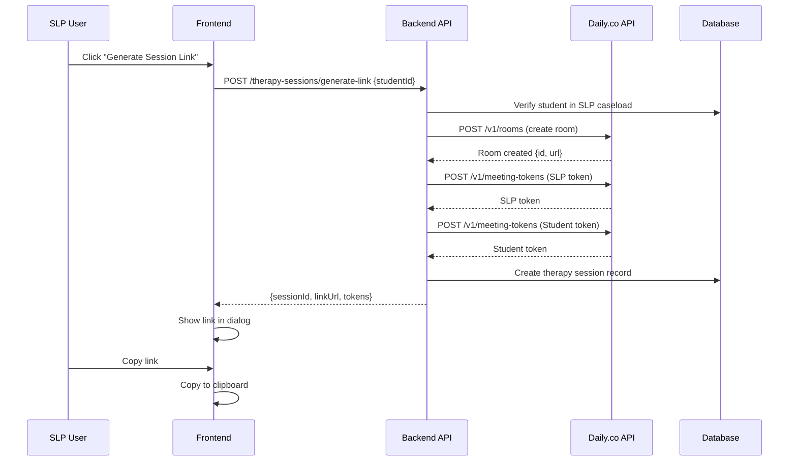

# Session Summary - Session Link Generation Implementation

## Overview

This session focused on implementing the core session link generation feature (Feature 1 from [Initial Ideas V2](./initial-ideas-v2.mdx)) for the Empat Challenge virtual speech therapy platform. The implementation includes full Daily.co integration for video call sessions, database schemas for the simplified therapy model, and a complete frontend interface for SLPs to generate and share session links with their students.

### Key Features Implemented

- **Session Link Generation**: SLP can generate unique, shareable links for therapy sessions
- **Daily.co Integration**: Automatic room creation and token generation for both SLP and student
- **Caseload Management**: View and manage students in SLP's caseload
- **Link Sharing UI**: Copy-to-clipboard functionality with expiration display

### Technologies Used

- **Backend**: Bun + Elysia
- **Database**: PostgreSQL with Drizzle ORM
- **Frontend**: React + TanStack Start + TanStack Query
- **Video Calls**: Daily.co WebRTC API
- **Validation**: Zod v4
- **Authentication**: better-auth

## Database Schemas Created

### 1. Therapy Session Status Enum

**File**: `packages/db/src/enums/therapy-session-status.ts`

Created enum for tracking therapy session status:
- `scheduled` - Session link generated, waiting to start
- `active` - Session is currently in progress
- `completed` - Session has ended
- `cancelled` - Session was cancelled

### 2. Student Table

**File**: `packages/db/src/schema/student.ts`

Table to store student (child) information:
- `id` (uuid, primary key)
- `name` (text, required)
- `age` (integer, optional)
- `inactive` (timestamp, nullable - null means active)
- `createdAt`, `updatedAt`, `deletedAt` (timestamps)

### 3. SLP Table

**File**: `packages/db/src/schema/slp.ts`

Table to store Speech Language Pathologist profile information:
- `id` (uuid, primary key)
- `userId` (text, foreign key to better-auth user table, unique)
- `name` (text, required)
- `phone` (text, optional)
- `createdAt`, `updatedAt`, `deletedAt` (timestamps)

### 4. Caseload Table

**File**: `packages/db/src/schema/caseload.ts`

Junction table for many-to-many relationship between SLPs and students:
- `id` (uuid, primary key)
- `slpId` (text, foreign key to SLP)
- `studentId` (text, foreign key to Student)
- `createdAt`, `updatedAt`, `deletedAt` (timestamps)
- Unique constraint on (slpId, studentId)

### 5. Therapy Session Table

**File**: `packages/db/src/schema/therapy-session.ts`

Table to track video call sessions between SLP and students:
- `id` (uuid, primary key)
- `slpId` (text, foreign key to SLP)
- `studentId` (text, foreign key to Student)
- `dailyRoomId` (text, required - Daily.co room ID)
- `dailyRoomUrl` (text, required - Daily.co room URL)
- `linkToken` (text, unique - token for session link)
- `status` (enum: scheduled, active, completed, cancelled)
- `expiresAt` (timestamp, nullable - link expiration)
- `startTime`, `endTime` (timestamps, nullable)
- `duration` (integer, nullable - minutes)
- `createdAt`, `updatedAt`, `deletedAt` (timestamps)

## Domain Schemas Created

### 1. Therapy Session Status Constants

**File**: `packages/domain/src/constants/therapy-session-status.ts`

Created constants for therapy session status values and labels.

### 2. Student Schemas

**File**: `packages/domain/src/schemas/student.ts`

- `studentBaseSchema` - Full student model with all fields
- `createStudentSchema` - Schema for creating new students (name, age)
- `updateStudentSchema` - Schema for updating students (partial)
- Type exports: `StudentBase`, `CreateStudent`, `UpdateStudent`

### 3. SLP Schemas

**File**: `packages/domain/src/schemas/slp.ts`

- `slpBaseSchema` - Full SLP model with all fields
- Type export: `SLPBase`

### 4. Therapy Session Schemas

**File**: `packages/domain/src/schemas/therapy-session.ts`

- `therapySessionBaseSchema` - Full session model
- `generateSessionLinkSchema` - Input schema (studentId only)
- `sessionLinkResponseSchema` - Response schema with link and tokens
- `updateSessionStatusSchema` - Schema for updating session status
- Type exports: `TherapySessionBase`, `GenerateSessionLink`, `SessionLinkResponse`, `UpdateSessionStatus`

## Backend Implementation

### 1. Daily.co Client Utility

**File**: `apps/server/src/utils/daily-client.ts`

Created utility functions for Daily.co API integration:

- `createDailyRoom(options)` - Creates a Daily.co room with configurable properties
- `generateMeetingToken(properties)` - Generates a meeting token for a specific room
- `generateSessionTokens(roomName, slpName, studentName, expiresIn)` - Generates tokens for both SLP and student

**API Endpoints Used**:
- `POST https://api.daily.co/v1/rooms` - Create room
- `POST https://api.daily.co/v1/meeting-tokens` - Generate token

### 2. Environment Variables

**File**: `apps/server/src/utils/env.ts`

Added validation for `DAILY_API_KEY`:
- Required environment variable
- Validated with Zod schema
- Used for Daily.co API authentication

### 3. Students Routes

**File**: `apps/server/src/routes/students.ts`

Read-only endpoints for managing students:
- `GET /api/v1/students` - List students in SLP's caseload (paginated)
- `GET /api/v1/students/:id` - Get single student details

**Authorization**: All endpoints require authentication and verify student belongs to SLP's caseload.

### 4. Therapy Sessions Routes

**File**: `apps/server/src/routes/therapy-sessions.ts`

Endpoints for session management:
- `POST /api/v1/therapy-sessions/generate-link` - Generate session link
  - Input: `{ studentId: string }`
  - Process:
    1. Validates student is in SLP's caseload
    2. Creates Daily.co room
    3. Generates meeting tokens for SLP (isOwner: true) and student (isOwner: false)
    4. Creates therapy session record in database
    5. Generates unique linkToken
    6. Returns: `{ sessionId, linkToken, linkUrl, dailyRoomUrl, slpToken, studentToken, expiresAt }`
- `GET /api/v1/therapy-sessions` - List SLP's sessions (paginated)
- `GET /api/v1/therapy-sessions/:id` - Get session details
- `PUT /api/v1/therapy-sessions/:id/status` - Update session status

**Authorization**: All endpoints require authentication and verify session belongs to SLP.

### 5. Server Configuration

**File**: `apps/server/src/index.ts`

- Added `studentRoutes` to API routes
- Added `therapySessionRoutes` to API routes
- Removed hiring-related routes (hiring-processes, company-details, interactions)

## Frontend Implementation

### 1. Students Hooks

**File**: `apps/web/src/hooks/use-students.ts`

React Query hooks for student data:
- `useStudents()` - Query hook for listing students in caseload
- `useStudent(id)` - Query hook for single student details

### 2. Therapy Sessions Hooks

**File**: `apps/web/src/hooks/use-therapy-sessions.ts`

React Query hooks for session management:
- `useGenerateSessionLink()` - Mutation for generating session link
- `useTherapySession(id)` - Query hook for single session
- `useTherapySessions()` - Query hook for listing sessions
- `useUpdateSessionStatus()` - Mutation for updating session status

### 3. Caseload View Component

**File**: `apps/web/src/components/caseload/caseload-view.tsx`

Main component for displaying and managing students:
- Displays list of students in SLP's caseload
- Shows student name, age, and status
- "Generate Session Link" button for each student
- Loading and error states
- Integration with `GenerateLinkDialog` component

### 4. Generate Link Dialog Component

**File**: `apps/web/src/components/therapy-session/generate-link-dialog.tsx`

Modal dialog for displaying generated session link:
- Shows generated link URL
- Copy to clipboard functionality
- Displays expiration date
- Student name context
- Close button

### 5. Caseload Route

**File**: `apps/web/src/routes/_authenticated/caseload/index.tsx`

Protected route that renders the CaseloadView component.

### 6. UI Updates

**Files Updated**:
- `apps/web/src/components/header.tsx` - Changed "Hiring Tool" to "Empat Challenge", updated navigation link to `/caseload`
- `apps/web/src/routes/__root.tsx` - Updated title from "Hiring Tool" to "Empat Challenge"
- `apps/web/src/routes/index.tsx` - Updated landing page content for therapy platform
- `apps/web/src/components/sign-up-form.tsx` - Updated redirect to `/caseload`
- `apps/web/src/components/sign-in-form.tsx` - Updated redirect to `/caseload`

## Code Cleanup

### Removed Hiring-Related Code

As part of transitioning from the hiring tool to the therapy platform, all hiring-related code was removed:

#### Database Schemas Removed
- `packages/db/src/schema/hiring-process.ts`
- `packages/db/src/schema/company-details.ts`
- `packages/db/src/schema/interaction.ts`
- `packages/db/src/schema/interview.ts`

#### Domain Schemas Removed
- `packages/domain/src/schemas/hiring-process.ts`
- `packages/domain/src/schemas/company-details.ts`
- `packages/domain/src/schemas/interaction.ts`

#### Constants and Enums Removed
- `packages/domain/src/constants/hiring-process-status.ts`
- `packages/domain/src/constants/interaction-type.ts`
- `packages/domain/src/constants/salary-rate-type.ts`
- `packages/domain/src/constants/currency.ts`
- `packages/db/src/enums/hiring-process-status.ts`
- `packages/db/src/enums/interaction-type.ts`
- `packages/db/src/enums/salary-rate-type.ts`
- `packages/db/src/enums/currency.ts`

#### Backend Routes Removed
- `apps/server/src/routes/hiring-processes.ts`
- `apps/server/src/routes/company-details.ts`
- `apps/server/src/routes/interactions.ts`

#### Frontend Hooks Removed
- `apps/web/src/hooks/use-hiring-processes.ts`
- `apps/web/src/hooks/use-company-details.ts`
- `apps/web/src/hooks/use-interactions.ts`
- `apps/web/src/hooks/use-interviews.ts`

#### Frontend Components Removed
- `apps/web/src/components/hiring-process/` (entire directory)
- `apps/web/src/components/interaction/` (entire directory)

#### Frontend Routes Removed
- `apps/web/src/routes/_authenticated/hiring-processes/` (entire directory)

### Updated References

- Changed all "Hiring Tool" references to "Empat Challenge"
- Updated navigation links from `/hiring-processes` to `/caseload`
- Updated landing page content to reflect therapy platform features
- Updated auth redirects to point to caseload view

## Daily.co Integration Details

### Room Creation Process

When a session link is generated:

1. **Room Creation**: A private Daily.co room is created with:
   - Unique room name: `session-{linkToken}`
   - Privacy: `private` (requires tokens to join)
   - Max participants: 2 (SLP and student)
   - UI features enabled: people UI, chat, prejoin UI

2. **Token Generation**: Two meeting tokens are generated:
   - **SLP Token**: `isOwner: true` - Full control (can share screen, manage room)
   - **Student Token**: `isOwner: false` - Participant access
   - Both tokens expire in 24 hours by default

3. **Database Storage**: Session record stores:
   - Daily.co room ID and URL
   - Link token for shareable link
   - Expiration timestamp
   - Status: `scheduled`

### API Configuration

**Required Environment Variable**:
```
DAILY_API_KEY=your_daily_co_api_key_here
```

**API Base URL**: `https://api.daily.co/v1`

**Authentication**: Bearer token in Authorization header

### Link Generation Flow



## Files Created

### Database Layer

| File Path | Description |
|-----------|-------------|
| `packages/db/src/enums/therapy-session-status.ts` | Therapy session status enum |
| `packages/db/src/schema/slp.ts` | SLP table schema |
| `packages/db/src/schema/student.ts` | Student table schema |
| `packages/db/src/schema/caseload.ts` | Caseload junction table schema |
| `packages/db/src/schema/therapy-session.ts` | Therapy session table schema |

### Domain Layer

| File Path | Description |
|-----------|-------------|
| `packages/domain/src/constants/therapy-session-status.ts` | Therapy session status constants |
| `packages/domain/src/schemas/slp.ts` | SLP Zod schemas |
| `packages/domain/src/schemas/student.ts` | Student Zod schemas |
| `packages/domain/src/schemas/therapy-session.ts` | Therapy session Zod schemas |

### Backend

| File Path | Description |
|-----------|-------------|
| `apps/server/src/utils/daily-client.ts` | Daily.co API client utility |
| `apps/server/src/routes/students.ts` | Students API routes |
| `apps/server/src/routes/therapy-sessions.ts` | Therapy sessions API routes |

### Frontend

| File Path | Description |
|-----------|-------------|
| `apps/web/src/hooks/use-students.ts` | Students React Query hooks |
| `apps/web/src/hooks/use-therapy-sessions.ts` | Therapy sessions React Query hooks |
| `apps/web/src/components/caseload/caseload-view.tsx` | Caseload view component |
| `apps/web/src/components/therapy-session/generate-link-dialog.tsx` | Generate link dialog component |
| `apps/web/src/routes/_authenticated/caseload/index.tsx` | Caseload route page |

## Files Modified

### Database Layer

| File Path | Changes |
|-----------|---------|
| `packages/db/src/schema/index.ts` | Added exports for new schemas, removed hiring-related exports |
| `packages/db/src/enums/index.ts` | Added therapy-session-status export, removed hiring-related exports |
| `packages/db/src/schema/auth.ts` | Removed interview table relation reference |

### Domain Layer

| File Path | Changes |
|-----------|---------|
| `packages/domain/src/constants/index.ts` | Added therapy-session-status export, removed hiring-related exports |
| `packages/domain/src/schemas/index.ts` | Added new schema exports, removed hiring-related exports |

### Backend

| File Path | Changes |
|-----------|---------|
| `apps/server/src/utils/env.ts` | Added `DAILY_API_KEY` validation |
| `apps/server/src/index.ts` | Added student and therapy-session routes, removed hiring-related routes |

### Frontend

| File Path | Changes |
|-----------|---------|
| `apps/web/src/components/header.tsx` | Updated branding and navigation link |
| `apps/web/src/routes/__root.tsx` | Updated page title |
| `apps/web/src/routes/index.tsx` | Updated landing page content for therapy platform |
| `apps/web/src/components/sign-up-form.tsx` | Updated redirect destination |
| `apps/web/src/components/sign-in-form.tsx` | Updated redirect destination |

## Files Deleted

### Database Schemas

- `packages/db/src/schema/hiring-process.ts`
- `packages/db/src/schema/company-details.ts`
- `packages/db/src/schema/interaction.ts`
- `packages/db/src/schema/interview.ts`

### Domain Schemas

- `packages/domain/src/schemas/hiring-process.ts`
- `packages/domain/src/schemas/company-details.ts`
- `packages/domain/src/schemas/interaction.ts`

### Constants and Enums

- `packages/domain/src/constants/hiring-process-status.ts`
- `packages/domain/src/constants/interaction-type.ts`
- `packages/domain/src/constants/salary-rate-type.ts`
- `packages/domain/src/constants/currency.ts`
- `packages/db/src/enums/hiring-process-status.ts`
- `packages/db/src/enums/interaction-type.ts`
- `packages/db/src/enums/salary-rate-type.ts`
- `packages/db/src/enums/currency.ts`

### Backend Routes

- `apps/server/src/routes/hiring-processes.ts`
- `apps/server/src/routes/company-details.ts`
- `apps/server/src/routes/interactions.ts`

### Frontend Hooks

- `apps/web/src/hooks/use-hiring-processes.ts`
- `apps/web/src/hooks/use-company-details.ts`
- `apps/web/src/hooks/use-interactions.ts`
- `apps/web/src/hooks/use-interviews.ts`

### Frontend Components and Routes

- `apps/web/src/components/hiring-process/` (entire directory - 7 files)
- `apps/web/src/components/interaction/` (entire directory - 6 files)
- `apps/web/src/routes/_authenticated/hiring-processes/` (entire directory - 4 files)

**Reason for Removal**: These files were part of the original hiring tool application and are not needed for the therapy platform. Removing them reduces codebase complexity and focuses on the core therapy features.

## Environment Variables

### Required Variables

Add to `.env` file or Railway environment variables:

```bash
DAILY_API_KEY=your_daily_co_api_key_here
```

**Where to get the API key**: 
1. Log in to [Daily.co Dashboard](https://dashboard.daily.co/)
2. Navigate to Developers section
3. Copy your domain API key

**Note**: The API key is validated on server startup. Missing or invalid key will cause the server to fail with a clear error message.

## Implementation Flow

The complete flow from SLP clicking "Generate Session Link" to receiving a shareable link:

1. **Frontend**: SLP clicks "Generate Session Link" button for a student
2. **Frontend**: Calls `useGenerateSessionLink()` mutation with `{ studentId }`
3. **Backend**: Validates student belongs to SLP's caseload
4. **Backend**: Creates Daily.co room via API
5. **Backend**: Generates meeting tokens for both SLP and student
6. **Backend**: Creates therapy session record in database
7. **Backend**: Generates unique linkToken
8. **Backend**: Returns response with link URL and tokens
9. **Frontend**: Displays link in modal dialog
10. **Frontend**: SLP can copy link to share with student

## Next Steps

### Immediate Actions Required

1. **Database Migrations**
   - Run Drizzle migrations to create new tables:
     ```bash
     bun run --filter=@empat-challenge/db db:generate
     bun run --filter=@empat-challenge/db db:push
     ```

2. **Environment Setup**
   - Set `DAILY_API_KEY` in `.env` file or Railway environment variables
   - Verify API key has proper permissions in Daily.co dashboard

3. **Testing**
   - Test link generation flow end-to-end
   - Verify Daily.co room creation
   - Test token generation
   - Verify link expiration handling
   - Test caseload authorization (SLP can only see their students)

### Future Features to Implement

Based on [Initial Ideas V2](./initial-ideas-v2.mdx), the following features are next:

1. **Student Session View** (Feature 2)
   - Page for students to join via link
   - Daily.co video call integration
   - Link validation endpoint

2. **Interactive Phaser Game** (Feature 3)
   - Game implementation
   - WebSocket synchronization
   - Game state persistence

3. **Session Data Recording** (Feature 4)
   - Trial tracking UI
   - Behavioral notes input
   - Real-time data saving

4. **Student Profile with Progress** (Feature 5)
   - Progress visualization charts
   - Recent session summaries
   - Metrics aggregation

5. **AI Session Summary** (Feature 7)
   - LLM API integration
   - Summary generation endpoint
   - Display on student profile

## Technical Decisions

### Why Link-Based Sessions

- Simpler than building a scheduling system
- Covers the core use case effectively
- Links can be shared via any channel (email, SMS, messaging apps)
- No need for calendar integration or timezone handling

### Why Direct SLP-Student Relationship

- Removes parent/guardian authentication complexity
- Simplifies authorization (SLP owns caseload)
- Faster to implement and test
- Still allows for future expansion if needed

### Why Daily.co

- Free tier available for development
- Simple REST API for room and token management
- WebRTC support built-in
- Good documentation and developer experience

### Why PostgreSQL

- Already using Drizzle ORM which works well with PostgreSQL
- Relational data fits the model (SLPs, Students, Sessions, etc.)
- Better for complex queries (progress tracking, aggregations)
- Neon PostgreSQL provides good free tier

## Code Quality Notes

- All schemas follow the existing pattern (base schema with derived create/update)
- All routes use consistent error handling and response helpers
- All hooks follow TanStack Query patterns
- Components use shadcn/ui for consistent styling
- Type safety maintained throughout with Zod validation
- Authorization checks ensure SLP can only access their own data

## References

- [Initial Ideas V2](./initial-ideas-v2.mdx) - Architecture and feature definitions
- [Challenge Info](./challenge-info.mdx) - Original challenge requirements
- [Daily.co API Documentation](https://docs.daily.co/reference/rest-api) - API reference
