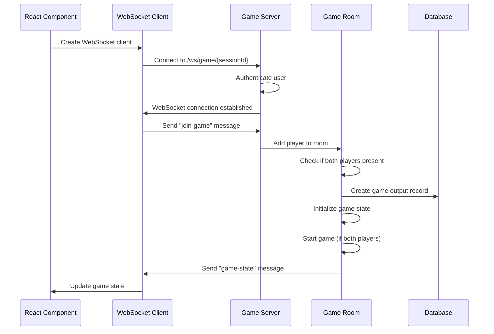
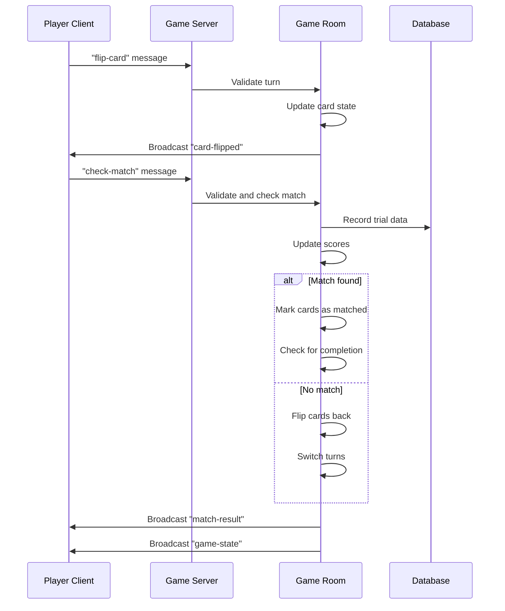

# Word-Picture Match Game - Implementation Details

## Overview

The Word-Picture Match game is a collaborative therapy game built with Phaser.js that allows Speech-Language Pathologists (SLPs) and students to play together in real-time during therapy sessions. The game uses WebSocket connections for real-time synchronization and automatically records trial data and game outcomes.

### Key Features

- **Real-time multiplayer**: SLP and student play together synchronously
- **Turn-based gameplay**: Alternating turns with match validation
- **Automatic data recording**: Trials and game outputs are automatically saved
- **Score tracking**: Individual scores for both players with accuracy calculations
- **Game state persistence**: Full game state saved to database

## Architecture

### Technology Stack

- **Frontend Game Engine**: Phaser.js 3.x
- **React Wrapper**: React component for integration
- **WebSocket**: Real-time bidirectional communication
- **Backend**: Bun + Elysia with WebSocket support
- **Database**: PostgreSQL with Drizzle ORM
- **State Management**: In-memory game rooms on server

### Component Structure

```
apps/web/src/components/game/word-picture-match/
├── game-container.tsx       # React wrapper component
├── websocket-client.ts       # WebSocket client wrapper
├── game-config.ts            # Phaser game configuration
├── preload-scene.ts          # Asset loading scene
├── game-scene.ts             # Main game scene
└── types.ts                  # TypeScript types

apps/server/src/websocket/
├── game-server.ts            # WebSocket connection handler
└── game-room.ts              # Game room logic and state management
```

## Frontend Implementation

### Game Container Component

**File**: `apps/web/src/components/game/word-picture-match/game-container.tsx`

The `WordPictureMatchGame` component is a React wrapper that:

1. **Client-side only rendering**: Uses `isClient` state to prevent SSR issues
2. **Dynamic imports**: Lazy loads Phaser and game modules
3. **WebSocket connection**: Creates and manages WebSocket client
4. **Phaser game initialization**: Creates Phaser game instance with scenes
5. **Cleanup**: Properly disconnects WebSocket and destroys game on unmount

**Key Features**:
- Loading states during connection and initialization
- Error handling with user-friendly messages
- Automatic cleanup on component unmount
- Passes WebSocket client and role to Phaser scenes

### WebSocket Client

**File**: `apps/web/src/components/game/word-picture-match/websocket-client.ts`

The `GameWebSocketClient` class provides:

1. **Connection management**:
   - Automatic reconnection (up to 5 attempts)
   - Exponential backoff for reconnection delays
   - Connection state tracking

2. **Message handling**:
   - Type-safe message parsing
   - Event handler registration system
   - Automatic game state updates

3. **Connection URL**:
   - Protocol detection (ws/wss based on page protocol)
   - API URL from environment or current origin
   - Token handling: "cookie" for SLP, linkToken for students

**Connection Flow**:
1. Client connects to `ws://host/ws/game/{sessionId}?token={token}&role={role}`
2. On connection, sends `join-game` message
3. Receives `game-state` message with current game state
4. Handles all game events via registered handlers

## Backend Implementation

### WebSocket Server

**File**: `apps/server/src/index.ts`

The WebSocket endpoint is registered using Elysia's `.ws()` method:

```typescript
.ws("/ws/game/:sessionId", {
  query: {
    token: { type: "string", optional: true },
    role: { type: "string" },
  },
  async open(ws) {
    // Authentication and validation
    // Store connection data
    // Handle join message
  },
  message(ws, message) {
    // Route messages to game room
  },
  close(ws) {
    // Cleanup player from room
  },
})
```

**Authentication**:
- **SLP**: Validates session from cookies (token can be "cookie" or empty)
- **Student**: Validates linkToken from query parameter
- Verifies session ownership and access

### Game Server Handler

**File**: `apps/server/src/websocket/game-server.ts`

The `handleGameWebSocket` function (legacy, now handled by Elysia `.ws()`) performs:

1. **Session ID extraction**: From URL path
2. **Token and role validation**: From query parameters
3. **User authentication**:
   - SLP: Cookie-based session validation
   - Student: LinkToken validation
4. **Session verification**: Ensures session exists and user has access
5. **WebSocket upgrade**: Uses Bun's native WebSocket upgrade

**Message Handlers**:
- `handleWebSocketMessage`: Routes messages to game room
- `handleWebSocketClose`: Removes player from room and cleans up

### Game Room

**File**: `apps/server/src/websocket/game-room.ts`

The `GameRoom` class manages the game state and logic:

#### State Management

- **In-memory storage**: `gameRooms` Map stores active rooms
- **Player management**: Tracks SLP and student connections
- **Game state**: Complete game state with cards, scores, matches
- **Database integration**: Creates and updates game output records

#### Game Flow

1. **Initialization** (`initializeGame`):
   - Creates card states from card set
   - Shuffles card positions
   - Initializes game state with "waiting" status
   - Creates game output record in database
   - Starts game if both players connected

2. **Game Start** (`startGame`):
   - Changes status to "playing"
   - Sets start timestamp
   - Broadcasts game state to all players
   - Announces turn change

3. **Card Flipping** (`handleFlipCard`):
   - Validates player's turn
   - Validates card exists and not matched/flipped
   - Enforces max 2 cards flipped
   - Updates game state
   - Broadcasts card flip event

4. **Match Checking** (`handleCheckMatch`):
   - Validates both cards are flipped
   - Checks if cards match (by matchId)
   - Updates player scores (matches, attempts, accuracy)
   - Records trial in database
   - Creates match record
   - If match: marks cards as matched, checks for completion
   - If no match: flips cards back, switches turns
   - Broadcasts match result

5. **Turn Management** (`handleEndTurn`):
   - Flips back all flipped cards
   - Switches to next player
   - Increments turn counter
   - Broadcasts turn change

6. **Game Completion** (`completeGame`):
   - Changes status to "completed"
   - Calculates duration
   - Determines winner (or tie)
   - Updates game output in database with final scores
   - Broadcasts completion event

#### Database Integration

**Game Output Record**:
- Created when game initializes
- Updated with final scores, accuracy, duration on completion
- Stores full game state as JSONB
- Links to therapy session via `therapySessionId`

**Trial Data Recording**:
- Each match attempt creates a trial record
- Records correct/incorrect status
- Links to therapy session
- Includes notes about the match attempt

## Game State Structure

### GameState Type

```typescript
interface GameState {
  // Identification
  gameId: string;                    // UUID
  therapySessionId: string;         // Links to session
  gameType: "word-picture-match";
  
  // Status
  status: "waiting" | "playing" | "paused" | "completed";
  
  // Turn management
  currentPlayer: "slp" | "student";
  turnsPlayed: number;
  
  // Cards
  cardSetId: string;
  cards: CardState[];
  flippedCards: string[];            // Max 2 card IDs
  
  // Matches
  matches: Match[];
  
  // Scoring
  score: {
    slp: { matches: number; attempts: number; accuracy: number };
    student: { matches: number; attempts: number; accuracy: number };
  };
  
  // Timing
  startedAt: string | null;          // ISO timestamp
  completedAt: string | null;         // ISO timestamp
  lastActivityAt: string;             // ISO timestamp
  
  // Metadata
  metadata?: {
    difficulty?: string;
    cardSetName?: string;
  };
}
```

### CardState Type

```typescript
interface CardState {
  id: string;
  type: "word" | "picture";
  content: string;                    // Word text or picture description
  matchId: string;                    // ID of matching card
  imageUrl?: string;                   // For picture cards
  flipped: boolean;
  matched: boolean;
  position: number;                    // Grid position index
}
```

## WebSocket Message Protocol

### Client → Server Messages

#### Join Game
```typescript
{
  type: "join-game",
  payload: {
    therapySessionId: string;
    role: "slp" | "student";
  },
  timestamp: string;
}
```

#### Flip Card
```typescript
{
  type: "flip-card",
  payload: {
    cardId: string;
  },
  player: "slp" | "student",
  timestamp: string;
}
```

#### Check Match
```typescript
{
  type: "check-match",
  payload: {
    card1Id: string;
    card2Id: string;
  },
  player: "slp" | "student",
  timestamp: string;
}
```

#### End Turn
```typescript
{
  type: "end-turn",
  payload: {},
  player: "slp" | "student",
  timestamp: string;
}
```

#### Pause Game (SLP only)
```typescript
{
  type: "pause-game",
  payload: {},
  player: "slp",
  timestamp: string;
}
```

#### Resume Game (SLP only)
```typescript
{
  type: "resume-game",
  payload: {},
  player: "slp",
  timestamp: string;
}
```

#### End Game (SLP only)
```typescript
{
  type: "end-game",
  payload: {},
  player: "slp",
  timestamp: string;
}
```

### Server → Client Messages

#### Game State
```typescript
{
  type: "game-state",
  payload: GameState,
  timestamp: string;
}
```

#### Card Flipped
```typescript
{
  type: "card-flipped",
  payload: {
    cardId: string;
    player: "slp" | "student";
  },
  timestamp: string;
}
```

#### Match Result
```typescript
{
  type: "match-result",
  payload: {
    card1Id: string;
    card2Id: string;
    correct: boolean;
    player: "slp" | "student";
    newScore: {
      slp: { matches: number; attempts: number; accuracy: number };
      student: { matches: number; attempts: number; accuracy: number };
    };
  },
  timestamp: string;
}
```

#### Turn Changed
```typescript
{
  type: "turn-changed",
  payload: {
    currentPlayer: "slp" | "student";
    reason: "incorrect-match" | "end-turn" | "game-start";
  },
  timestamp: string;
}
```

#### Game Completed
```typescript
{
  type: "game-completed",
  payload: {
    finalScore: {
      slp: { matches: number; attempts: number; accuracy: number };
      student: { matches: number; attempts: number; accuracy: number };
    };
    winner: "slp" | "student" | "tie";
    duration: number;                 // seconds
  },
  timestamp: string;
}
```

#### Game Paused
```typescript
{
  type: "game-paused",
  payload: {},
  timestamp: string;
}
```

#### Game Resumed
```typescript
{
  type: "game-resumed",
  payload: {},
  timestamp: string;
}
```

#### Error
```typescript
{
  type: "error",
  payload: {
    message: string;
    code?: string;
  },
  timestamp: string;
}
```

## Game Mechanics

### Turn System

- **Alternating turns**: Players take turns flipping cards
- **Turn validation**: Server enforces turn order
- **Turn switching**:
  - After incorrect match
  - When player ends turn manually
  - At game start (SLP goes first)

### Card Matching

1. **Flip Phase**: Player flips up to 2 cards
2. **Match Check**: Player checks if flipped cards match
3. **Result**:
   - **Match**: Cards marked as matched, player continues turn
   - **No Match**: Cards flip back, turn switches to other player
4. **Scoring**: Each attempt increments attempts counter, matches increment matches counter
5. **Accuracy**: Calculated as `(matches / attempts) * 100`

### Game Completion

Game completes when:
- All cards are matched
- SLP manually ends the game

On completion:
- Final scores calculated
- Winner determined (or tie)
- Duration calculated
- Game output updated in database
- Completion event broadcast to all players

## Data Flow

### Game Initialization Flow



### Match Attempt Flow



## Database Schema

### Game Output Table

Stores complete game sessions:

- `id` (UUID): Primary key
- `therapySessionId` (text): Foreign key to therapy session
- `gameType` (text): "word-picture-match"
- `gameState` (JSONB): Complete game state snapshot
- `score` (integer): Total score
- `accuracy` (numeric): Overall accuracy percentage
- `duration` (integer): Game duration in seconds
- `turnsPlayed` (integer): Total number of turns
- `playerResults` (JSONB): Individual player scores
- `gameEvents` (JSONB): Array of match events
- `startedAt` (timestamp): Game start time
- `completedAt` (timestamp): Game completion time

### Trial Data Table

Records individual match attempts:

- `id` (UUID): Primary key
- `therapySessionId` (text): Foreign key to therapy session
- `trialNumber` (integer): Sequential trial number
- `isCorrect` (boolean): Whether match was correct
- `timestamp` (timestamp): When trial occurred
- `notes` (text): Optional notes about the trial

## Card Sets

Currently uses a hardcoded default card set:

**Default Set**: "Basic Animals" (Easy)
- Cat (word + picture)
- Dog (word + picture)
- Bird (word + picture)
- Fish (word + picture)

**Future Enhancement**: Load card sets from JSON files or database

## Error Handling

### Client-Side Errors

- **Connection failures**: Automatic reconnection with exponential backoff
- **Message parsing errors**: Logged, game continues
- **Game initialization errors**: Displayed to user with retry option

### Server-Side Errors

- **Authentication failures**: WebSocket connection closed with error code
- **Invalid messages**: Error message sent to client
- **Database errors**: Logged, game continues (non-critical)
- **Validation errors**: Error message sent to client with details

## Security Considerations

1. **Authentication**:
   - SLP: Cookie-based session validation
   - Student: LinkToken validation
   - Session ownership verification

2. **Authorization**:
   - SLP can pause/resume/end game
   - Turn validation prevents cheating
   - Session access verification

3. **Data Validation**:
   - All messages validated on server
   - Card IDs verified against game state
   - Turn order enforced

## Performance Considerations

1. **In-memory game rooms**: Fast access, but lost on server restart
2. **WebSocket connections**: Persistent connections for real-time updates
3. **Database writes**: Async writes don't block game flow
4. **State synchronization**: Full state sent on every update (could be optimized)

## Future Enhancements

1. **Card set management**: Load from database or JSON files
2. **Game state persistence**: Save/restore game state
3. **Multiple game types**: Extend to other therapy games
4. **Spectator mode**: Allow viewing without playing
5. **Game replays**: Record and replay completed games
6. **Difficulty levels**: Multiple card sets with varying difficulty
7. **Custom card sets**: Allow SLP to create custom card sets

## Files Changed

### Frontend
- `apps/web/src/components/game/word-picture-match/game-container.tsx`
- `apps/web/src/components/game/word-picture-match/websocket-client.ts`
- `apps/web/src/components/game/word-picture-match/game-scene.ts`
- `apps/web/src/components/game/word-picture-match/preload-scene.ts`
- `apps/web/src/components/game/word-picture-match/game-config.ts`

### Backend
- `apps/server/src/index.ts` (WebSocket route)
- `apps/server/src/websocket/game-server.ts`
- `apps/server/src/websocket/game-room.ts`

### Domain Types
- `packages/domain/src/types/game-state.ts`
- `packages/domain/src/types/game-messages.ts`

### Database
- `packages/db/src/schema/game-output.ts`
- `packages/db/src/schema/trial-data.ts`
